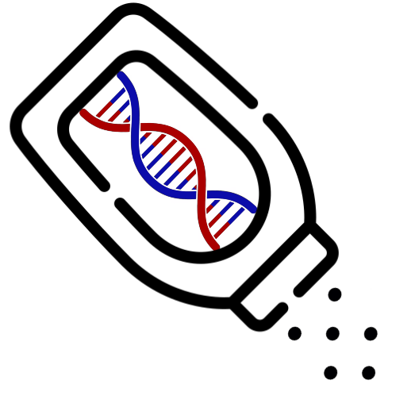
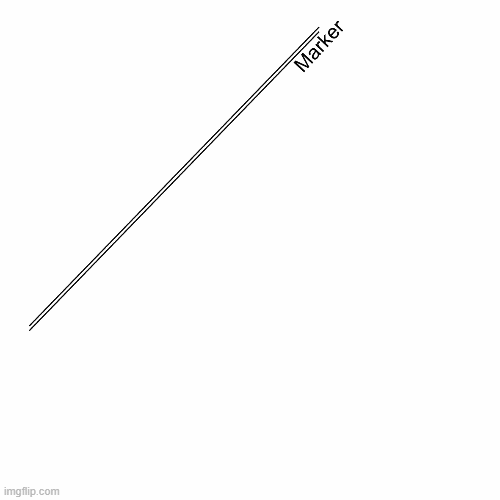

# TALCO

[license-badge]: https://img.shields.io/badge/License-MIT-yellow.svg 
[license-link]: https://github.com/TurakhiaLab/TALCO/blob/main/LICENSE

[![License][license-badge]][license-link]
[](https://doi.org/10.5281/zenodo.10306077)
[](https://ieeexplore.ieee.org/document/10476438)
[](https://www.hpca-conf.org/2024/program/main.php)
<div align="center">

</div>

**TALCO** is a novel method for **T**iling genome sequence **AL**ignment using
**CO**nvergence of traceback pointers, that, similar to prior tiling techniques, maintains a constant memory footprint during the acceleration step independent of alignment length. However, unlike previous techniques, TALCO also ensures optimal alignments under banding constraints. TALCO does this by leveraging the convergence of traceback paths beyond a tile to a single point on the boundary of that tile – a strategy that seems to generalize well to a broad set of sequence alignment algorithms. To demonstrate generalizability, we apply TALCO to widely-used banded sequence alignment algorithms, X-Drop and WFA-Adapt. We call the modified algorithms
TALCO-XDrop and TALCO-WFAA, respectively.

<div align="center">
<h3>Animation showing working of TALCO applied to X-Drop algorithm (TALCO-XDrop)</h3>

</div>


This repository contains CPU and ASIC implementations of TALCO-XDrop and TALCO-WFAA. 

## **Repository Structure**
```
.
└── 1. dataset
└── 2. hardware # ASIC implementations
	└── TALCO-XDrop
	└── TALCO-WFAA
	└── scripts
	└── baselines
└── 3. software # CPU implementations
	└── TALCO-XDrop
	└── TALCO-WFAA
	└── scripts
	└── baselines
```

## **Citing TALCO**

If you use **TALCO** in your work, please cite the following paper:
* Sumit Walia, Cheng Ye, Arkid Bera, Dhruvi Lodhavia, Yatish Turakhia, "*TALCO: Tiling Genome Sequence Alignment using Convergence of Traceback Pointers*", In 2024 IEEE International Symposium on High-Performance Computer Architecture (**HPCA**), [[Paper](paper/TALCO.pdf)][[Video](https://www.youtube.com/watch?v=lPZ_WxTJiNw)].

## **Getting Help**
We appreciate any feedback and suggestions. Feel free to raise an issue or submit a pull request on GitHub or contact Sumit Walia (swalia AT ucsd DOT edu).
